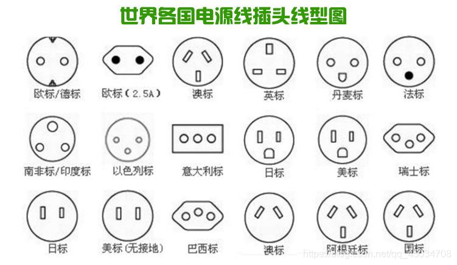

## 背景故事



众所周知，世界是个巨大的草台班子，每个团队都有自己的标准，当标准与标准碰撞的时候，苦难便开始了。

你一定遇到过接口不兼容的问题吧？然后你需要一个叫做转接器或者适配器的小玩意，为接口做适配工作。而在代码上，适配器模式的作用也是在两个接口之间做适配。

## 代码演示

假设你在升级支付系统，需要整合新旧支付接口：

- **旧版接口**：`LegacyPaymentProcessor` (仅支持XML格式请求)
```cs
    
    public class LegacyPaymentProcessor {
        public string ProcessPayment(string xmlRequest) {
            // 处理XML支付请求
            return "<Response><Status>Success</Status></Response>";
        }
    }
    
```
- **新版接口**：`IPaymentGateway` (要求JSON格式请求)
```cs
    
    public interface IPaymentGateway {
        string Pay(string jsonRequest); // 期望JSON输入
    }
    
```

```cs [适配器]
public class ImageAdapter : IRenderer
{
    private readonly LegacyPaymentProcessor _legacyProcessor;

    public ImageAdapter(LegacyPaymentProcessor legacyProcessor)
    {
        _legacyProcessor = legacyProcessor;
    }

    public void Pay(string jsonRequest)
    {
	    var xml = xml.trans(jsonRequest);
        // 将 Pay 请求转换为 ProcessPayment 调用
        _legacyProcessor.ProcessPayment(xml);
    }
}

```

直接调用旧接口会导致：

1. 客户端需手动转换数据格式（XML↔JSON）
2. 业务逻辑与转换代码耦合
3. 系统无法统一处理支付请求

适配器模式通过**接口转换层**，让新旧组件无缝协作。

## 定义

> **适配器模式（Adapter）**：将一个类的接口转换成客户端所期望的另一个接口，使原本因接口不兼容而无法一起工作的类可以协同工作。

<import filepath="./UML/6.puml" />

## 应用场景

适配器模式用于解决**接口不兼容**问题。它广泛应用于第三方库接口冲突、旧代码复用、统一多个类似接口、框架升级等场景。

在小的接口不统一问题发生时，及时重构，只有碰到无法改变原有设计和代码时，即旧代码稳定且测试充分而重写成本过高时，才考虑适配。

## 总结

**优点**
- **复用旧代码**：无需修改适配者即可整合遗留系统
- **解耦客户端**：客户端仅依赖目标接口，与适配者无关
- **灵活扩展**：使不兼容的接口能够协同工作，可新增适配器支持不同接口

**缺点**
- **过度复杂**：过多适配器会降低代码可读性
- **性能损耗**：多层转换可能影响性能（如XML↔JSON）

### 模式对比

以下三种模式都是为代码添加了一层包装。

| 模式      | 核心功能       | 关键区别        |
| ------- | ---------- | ----------- |
| **适配器** | **接口转换**   | 解决现有类的接口不兼容 |
| **装饰器** | **增强功能**   | 动态添加新职责     |
| **外观**  | **简化复杂系统** | 提供统一高层接口    |
