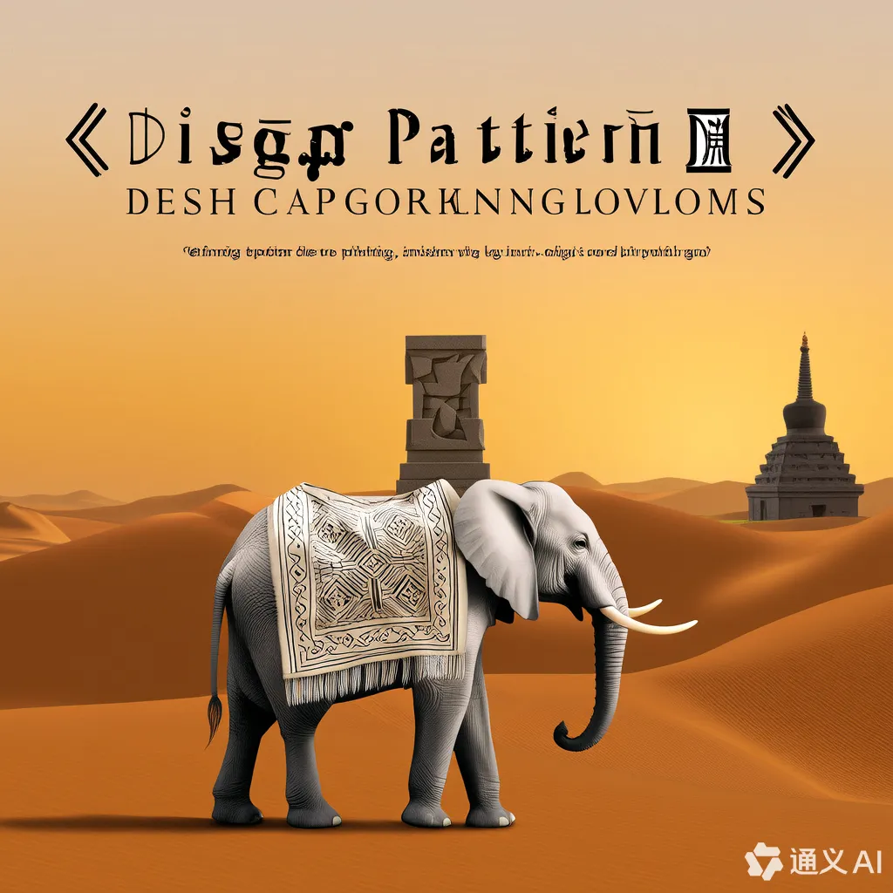

## 什么是设计模式

设计模式由 GoF（Gang of Four，四人帮）于 1994 年在《Design Patterns: Elements of Reusable Object-Oriented Software》中提出，归纳了 23 种经典的、可复用的面向对象设计方案，按用途分为三大类：

- 创建型（Creational）

- 结构型（Structural）

- 行为型（Behavioral）

编程的目的是通过代码解决实际问题，而设计模式的核心在于解决编程中出现的问题。前辈们摸着石头过河，踩过无数坑后，留下了设计模式这样的宝贵经验。

不要有学习压力，很多模式看似高深，实则来源于开发者日常应对复杂业务所形成的通用解决思路。

不要教条主义，设计模式是一种规范，而不是强制性的。

## 常见疑问与解答

1. **学习设计模式有先后顺序吗？应该按照顺序去学吗？**
   推荐按顺序，从简单到复杂，循序渐进地建立起对模式分类与适用场景的认识。当然也可以结合自身需求选学使用。
2. **我没有任何编程基础也可以学吗？**
   可以。设计模式以 UML 图为核心，配合图文讲解，适合零基础入门者学习。如果有基础，理解会更加深刻。
3. **我的语言是 XX，教程却是 YY，这样能学吗？**
   完全可以。设计模式本质上是语言无关的。尽管 GoF 原书使用 C++ 和 Smalltalk，但模式思想同样适用于 Java、C#、Rust、C 等语言。
4. **本书使用哪些语言和版本？**
   本书于 2025 年进行总结编订，代码兼顾通用性与现代性：
   - `C++ 11`(2011 年)
   - `Java 11`(2018 年)
   - `C# 12.0 .Net8.0`(2023 年)
   - `Rust 1.86.0`(2025 年)

## 概括设计模式

### 一、创建型模式

关注对象的创建方式，目标是将对象的创建与使用解耦。

| 模式                         | 描述                                               |
| ---------------------------- | -------------------------------------------------- |
| 简单工厂（Simple Factory）   | 用一个工厂类负责创建对象，封装实例化逻辑。         |
| 工厂方法（Factory Method）   | 定义创建对象的接口，将实例化延迟到子类中。         |
| 抽象工厂（Abstract Factory） | 提供创建一系列相关对象的接口，无需指定具体类。     |
| 单例（Singleton）            | 保证一个类仅有一个实例，并提供全局访问点。         |
| 建造者（Builder）            | 分步骤构建复杂对象，将构建过程与表示解耦。         |
| 原型（Prototype）            | 通过复制已有实例生成新对象，适合高开销的创建场景。 |

### 二、结构型模式

关注类和对象的组合方式，强调对象之间的静态结构。

| 模式                | 描述                                               |
| ------------------- | -------------------------------------------------- |
| 适配器（Adapter）   | 转换一个接口，使原本不兼容的类协同工作。           |
| 桥接（Bridge）      | 将抽象与实现分离，使它们可以独立变化。             |
| 组合（Composite）   | 以树形结构组织对象，实现部分-整体的一致性处理。    |
| 装饰器（Decorator） | 动态为对象添加新职责，替代继承机制。               |
| 外观（Facade）      | 提供统一接口，简化子系统复杂度。                   |
| 享元（Flyweight）   | 通过共享技术支持大量细粒度对象复用。               |
| 代理（Proxy）       | 为对象提供代理控制访问，例如延迟加载、安全控制等。 |

### 三、行为型模式

关注对象之间的通信(调用)与职责分配。

| 模式                              | 描述                                                 |
| --------------------------------- | ---------------------------------------------------- |
| 模板方法（Template Method）       | 定义结构，将某些步骤延迟到子类实现。                 |
| 观察者（Observer）                | 建立一对多依赖关系，状态变更自动通知依赖对象。       |
| 策略（Strategy）                  | 封装算法族，使算法可自由切换互换。                   |
| 命令（Command）                   | 封装请求为对象，实现请求的记录与撤销。               |
| 职责链（Chain of Responsibility） | 使多个对象有机会处理请求，避免请求者与接收者的耦合。 |
| 状态（State）                     | 封装状态，允许对象在状态变更时改变行为。             |
| 访问者（Visitor）                 | 在不改变结构的前提下添加新操作。                     |
| 中介者（Mediator）                | 封装对象之间交互，降低各对象耦合度。                 |
| 迭代器（Iterator）                | 提供遍历集合的统一接口，隐藏内部结构。               |
| 解释器（Interpreter）             | 定义语言文法并实现解释器。适用于表达式类处理。       |
| 备忘录（Memento）                 | 捕获对象状态，实现状态快照和恢复。                   |

## 修订版本号

2025-05-01 编写大纲
2025-05-04 写完所有创建者模式
2025-06-02 写完所有结构型模式
2025-06-05 写完所有行为型模式
2025-06-06 打磨了一些结构
2025-07-21 结构改为背景、演示、定义、应用、总结五部分
2025-07-26 全部模式重写 UML 图
2025-07-27 上传 GitHub 归档
